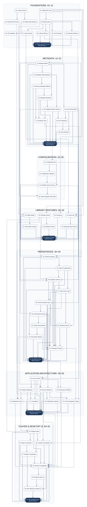

# C# Karaoke Challenge Roadmap

This directory contains the roadmap used to plan the C# Karaoke Challenges.

The roadmap has evolved alongside the challenge series as earlier challenges have been completed and the longer-term application architecture has become clearer.

## Current Roadmap

The current roadmap is:

- [`challenge-roadmap-v1.3.json`](challenge-roadmap-v1.3.json)

Version 1.3 represents the roadmap following completion of **Milestone 3 – Search & Playlist Milestone**.

The roadmap is stored as JSON to provide a structured representation of each challenge, including:

- Challenge number and title
- Phase and category
- Key concepts
- Dependencies on earlier challenges
- Expected outcome
- Completion status
- Notes

JSON replaces CSV as the current roadmap format from version 1.3 onward. This makes structured values such as concepts and challenge dependencies easier to represent and provides a format that can be consumed programmatically in the future.

## Current Direction

The completed challenges have progressed through:

- Foundations
- Metadata
- Configuration and library architecture
- Library features
- Three integration milestones

The next phase focuses on **Persistence**, beginning with JSON library persistence before introducing SQLite, database-backed search, incremental scanning, and library reconciliation.

Later phases currently explore:

- Application architecture
- Asynchronous scanning and cancellation
- Events and dependency injection
- Performance and broader testing
- Playback architecture
- MVVM and desktop UI development
- A small desktop music and karaoke player prototype

The roadmap is expected to continue evolving as the challenges progress and earlier implementations influence later design decisions.

## Challenge Dependency Map

Shows how challenges build on earlier work. Dark nodes represent
milestones. Solid arrows connect dependencies within a phase;
dashed arrows connect dependencies between phases.

The roadmap JSON remains the authoritative source.

[Open full-size diagram](challenge-dependencies.svg) ·
[View DOT source](challenge-dependencies.dot)

## Historical Roadmaps

Previous roadmap versions are retained in the [`archive`](archive/) directory as snapshots of how the learning plan evolved.

- [`challenge-roadmap-v1.0.csv`](archive/challenge-roadmap-v1.0.csv)
- [`challenge-roadmap-v1.1.csv`](archive/challenge-roadmap-v1.1.csv)
- [`challenge-roadmap-v1.2.csv`](archive/challenge-roadmap-v1.2.csv)

These files are historical references and are not updated when the current roadmap changes.

## Roadmap Versioning

A new roadmap version may be created when there is a meaningful change to the planned challenge sequence, scope, structure, or overall learning direction.

Completing an individual challenge does not necessarily require a new roadmap version. Its status can be updated in the current roadmap unless completing the challenge also results in broader roadmap changes.
